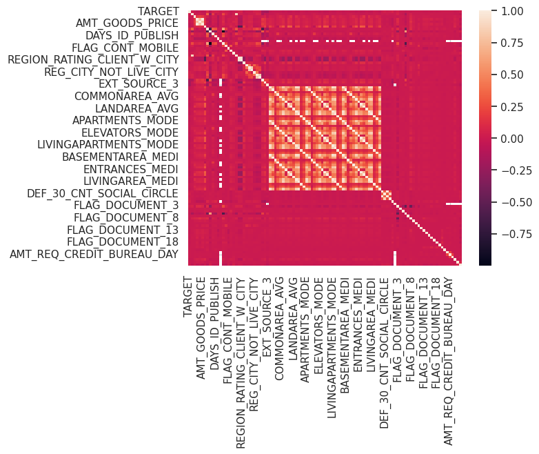
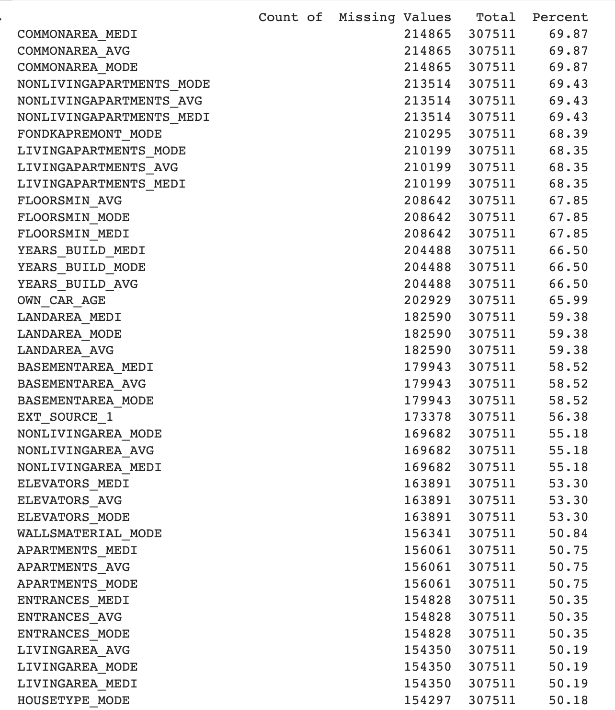
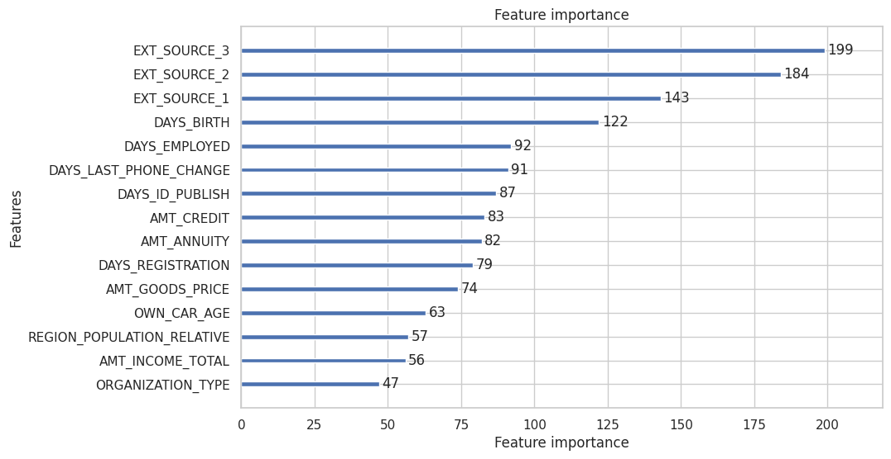

# Home Credit

Home Credit loan default analysis 

This notebook will walk you through the data available and how that data is used to train a model which Home Credit will then use to predict if a future loan applicant will default on their loan or not.

# EDA Findings

I started exploratory data analysis by reviewing the first few rows of each table to look at what data is available. 

The Home Credit dataset is a large dataset of loan applications from Home Credit, a financial services company. The dataset contains information about the borrowers, including their demographics, financial history, and employment status.

The dataset is divided into two parts: application_train.csv and application_test.csv. The application_train.csv file contains information about the loans that were approved, and the application_test.csv file contains information about the loans that were not approved.
The target variable in the dataset is TARGET, which indicates whether the loan was repaid (0) or defaulted (1).
The dataset contains a large number of features, including: 
- Demographic information, such as age, gender, and marital status
- Financial information, such as income, employment status, and credit history
- Other information, such as education level and home ownership

The dataset is imbalanced, meaning that there are more loans that were repaid than loans that were not repaid.

Some of the key findings from the EDA of the Home Credit dataset include:

The average age of the borrowers is 35 years old.
The majority of the borrowers are female (62%).
The most common marital status is married (58%).
The majority of the borrowers have a high school education or less (68%).
The majority of the borrowers have a credit history of less than 5 years.
The loans that are most likely to be repaid are those that are for small amounts, have a short repayment period, and are secured by collateral.
The EDA of the Home Credit dataset provides valuable insights into the factors that influence whether a loan will be repaid. This information can be used to develop models that can predict whether a loan will be repaid, which can help to reduce the risk of lending to borrowers who are likely to default.

Here are some additional questions that could be explored in the EDA of the Home Credit dataset:

1. What are the differences between the borrowers who repaid their loans and the borrowers who did not repay their loans?
2. How does the borrower's age, gender, marital status, education level, and employment status affect the likelihood of loan repayment?
3. How does the borrower's financial history, such as their credit score and debt-to-income ratio, affect the likelihood of loan repayment?
4. What are the factors that contribute to loan default?

The answers to these questions can help to improve our understanding of the factors that influence loan repayment and can be used to develop more effective models for predicting loan repayment.

Correlation: 

In this data, we have a mixed bag of information. Many columns are fully complete, many have more NAs than datapoints. Thankfully, the columns that do not have missing data will be important to our model; however, we will need to clean several columns for our model because of their NA values or their outlier data that is more erroneous than a true outlier.

# Modeling 

This process started by recognizing:
- Outliers and handling it appropriately: removed it in this situation 
- Imputing missing values: after factorizing the categorical features

The XGB model achieved an accuracy score of 91.67%. We upsampled the training data to ensure that we balance the dataset for the model fitting. 
The top 5 features that were most important for the model were:
EXT_SOURCE_1, 2, 3
DAYS_BIRTH
AMT_CREDIT
AMT_ANNUITY
AMT_GOODS_PRICE

The model was able to identify some of the factors that contribute to loan default, such as:
Younger borrowers are more likely to default on their loans.
Borrowers with lower incomes are more likely to default on their loans.
Borrowers with a poor credit history are more likely to default on their loans.
The model can be used to help lenders make more informed decisions about who to lend money to.
Here are some of the limitations of the XGB Classifier model:

The model is only as good as the data that it is trained on. If the data is not representative of the real world, then the model will not be able to make accurate predictions. The model is not perfect and can sometimes make mistakes. It is important to use the model in conjunction with other factors, such as human judgment, to make the best possible lending decisions.

Overall, the XGB Classifier model is a powerful tool that can be used to predict loan default. However, it is important to be aware of the limitations of the model and to use it in conjunction with other factors to make the best possible lending decisions.
